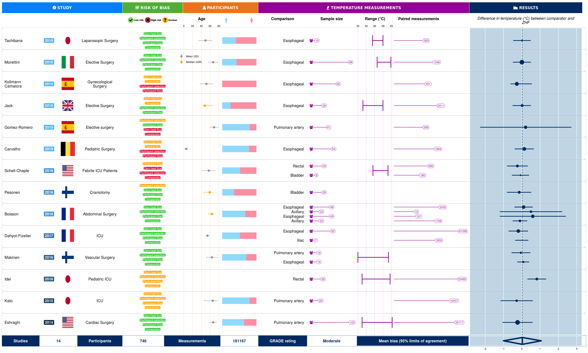

```{r echo=FALSE, include=FALSE}
library(tidyverse)
library(knitr)
library(ggprisma) # https://github.com/awconway/ggprisma
library(gt)
source("loa_maker.R")
source("meta.R")
```

```{r load-data, include=FALSE}
data <- readxl::read_xlsx(here::here("manuscript", "data", "zhf_extracted.xlsx"))
```


```{r meta-analysis-prep, include=FALSE}
data <- data %>%
  mutate(c = N/n)

#variance

data <- data %>% 
  mutate(s2 = case_when(corrected == "Yes"  ~ ((upper - bias)/1.96)^2,
         corrected == "No" ~  ((upper - bias)/1.96)^2*(N-1)/(N-c)
                        )
        )

data <- data %>% 
  mutate(V_bias = s2/n)

data <- data %>% 
  mutate(logs2 = log(s2)+1/(n-1))

data <- data %>% 
  mutate(V_logs2 = 2/(n-1))
```


```{r subgroups, include=FALSE}
# meta-analyses categories

data_NPA <- data %>% 
  filter(comparison == "NPA")

data_SL <- data %>% 
  filter(comparison == "Sublingual")

#eshragi overall
data_core <- data %>% 
  filter(comparison=="PA"|comparison=="Bladder"|comparison=="Eso" | comparison =="Rectal"|comparison =="Ax"|comparison =="Iliac") %>%
  filter(comments != "Intraoperative, off cardiopulmonary bypass" & comments != "Postoperative")

data_core_op <- data %>% #eshragi intraop
    filter(comparison=="PA"|comparison=="Bladder"|comparison=="Eso" | comparison =="Rectal"|comparison =="Ax"|comparison =="Iliac") %>%
  filter (clinical_setting=="Intraoperative")

data_core_icu <- data %>% #eshragi postop
      filter(comparison=="PA"|comparison=="Bladder"|comparison=="Eso" | comparison =="Rectal"|comparison =="Ax"|comparison =="Iliac") %>%
  filter(clinical_setting=="ICU" | clinical_setting=="Postoperative")

# ROB 

data_core_lowrisk <- data_core %>% #eshragi overall
  filter(RoB_selection == "low" & RoB_spoton == "low" & RoB_comparator == "low" & RoB_flow =="low")

# conflict of interests

data_conflict <- data_core %>% 
  filter(`Funding/equipment/conflict with ZHF company` == "No")

```

```{r format-result-function, include=FALSE}
format_results <- function(group){
out <- loa_maker(group$bias,group$V_bias, group$logs2, group$V_logs2)
out <- round(out, digits=2)
out <- out %>% 
  mutate(Participants = sum(group$n_count, na.rm=T)) %>% 
  mutate(Measurements = format(sum(group$N, na.rm = T), big.mark=",", scientific = FALSE)) %>% 
  mutate(Studies = length(unique(group$Study))) %>% 
  select(Studies, m, Participants, Measurements, bias_mean, sd2_est, tau_est, LOA_L, LOA_U, CI_L_rve, CI_U_rve) %>% 
  rename("Comparisons" = m)
out

# Better names for columns
# , "Mean bias" = bias_mean, "Tau-squared" = tau_est, "Lower bound for 95% limit of agreement" = LOA_L, "Upper bound for 95% limits of agreement" = LOA_U, "Outer confidence interval for lower 95% limits of agreement" = CI_L_rve, "Outer confidence interval for upper 95% limits of agreement" = CI_U_rve
}
```


```{r primary, include=FALSE}
primary <- format_results(data_core)
```


```{r sensitivity-low-risk, include=FALSE}
low_risk <- format_results(data_core_lowrisk)
```

```{r NPA, include=FALSE}
NPA  <- format_results(data_NPA)
```

```{r SL, include=FALSE}
SL  <- format_results(data_SL)
```

```{r OT, include=FALSE}
OT  <- format_results(data_core_op)
```

```{r ICU, include=FALSE}
ICU  <- format_results(data_core_icu)
```

```{r conflict, include=FALSE}
conflict  <- format_results(data_conflict)
```

<div class="l-page-outset">
<blockquote>
### Abstract

**Background**

Zero-heat-flux thermometers are non-invasive devices that can be used to continuously monitor temperature. These devices are increasingly being used in clinical practice to substitute for invasive core temperature measurement during surgery and in critical care settings. The aim of this review was to determine the accuracy and precision of zero-heat-flux temperature measurements. 

**Methods**

Medline and EMBASE were searched for studies that reported on a measurement of core or peripheral temperature that coincided with a measurement from the zero-heat-flux device. Study selection and quality assessment (using the QUADAS-2) was performed independently. The GRADE approach was used to summarize the strength of the body of evidence.  Pooled estimates of the mean bias and limits of agreement with outer 95% confidence intervals (termed population limits of agreement) were calculated. 

**Results**

Sixteen studies were included. The primary meta-analysis of zero-heat-flux versus core temperature measurements consisted of `r primary$Comparisons` comparisons from `r primary$Studies` individual studies. Data from `r primary$Participants` participants with `r format(primary$Measurements, scientfic=F)` paired measurements were included. The pooled estimate for the mean bias was `r primary$bias_mean`°C. Population limits of agreement, which take into consideration the between-study heterogeneity and sampling error, were wide, spanning from `r primary$CI_L_rve`°C to `r primary$CI_U_rve`°C. The GRADE evidence quality rating was downgraded to moderate due to concerns about study limitations. Population limits of agreement for the sensitivity analysis restricted to studies rated as having low risk of bias across all the domains of the QUADAS-2 were similar to the primary analysis.


**Conclusion**

The range of uncertainty in the accuracy of the zero-heat-flux thermometer should be taken into account when using measurements from this device to inform clinical decision-making. Clinicians should therefore consider the potential that a temperature measurement from a zero-heat-flux thermometer could be as much as 1°C higher or lower than core temperature. Use of this device may not be appropriate in situations where a difference in temperature of less than 1°C is important to detect. 

</blockquote>
</div>

## Introduction

Continuous core temperature monitoring is commonly used within perioperative and intensive care settings. Thermoregulatory dysfunction is commonly associated with the induction of anesthesia and can lead to adverse outcomes including cardiac arrhythmia, altered hemostasis and increased risk of surgical site infection.[@frank1997perioperative; @kurz1996perioperative; @michelson1994reversible; @rohrer1992effect] The pulmonary artery catheter is the reference standard for continuous core temperature monitoring, however, the invasive nature of this method renders an increased risk of bloodstream infections and damage to surrounding tissue.[@hadian2006evidence] Although clinically accurate relative to pulmonary artery temperature measurements, surrogate measures of core temperature at esophageal, rectal, and bladder locations remain mildly invasive interventions. 

Zero-heat-flux thermometry is an alternative non-invasive method that allows for continuous monitoring of core temperature. Originally developed in the 1970s, zero-heat-flux technology was recently implemented in the 3M SpotOn temperature monitoring system (3M, St Paul, MN), as a single-use, disposable sensor. In practice, the zero-heat-flux sensor, such as the 3M SpotOn, is placed on the lateral surface of the forehead and is initially warmed to equilibrate the temperature of the skin surface to the underlying core tissues. Equipped with a thermal insulator, the zero-heat-flux sensor eliminates heat loss to the environment to allow for changes in core temperature to be directly reflected by a change in skin surface temperature.[@eshraghi2014]

The agreement between zero-heat-flux thermometers and core as well as other peripheral thermometers has been investigated in multiple studies over the last five years. Appraisal of these studies and synthesis of the results would aid clinicians in deciding the appropriate circumstances in which zero-heat-flux thermometers may be used. We aimed to determine if zero-heat-flux thermometers have clinically acceptable accuracy and precision relative to established core and peripheral temperature measurement devices. Accuracy is defined as the average difference between temperature measurements from the zero-heat-flux and comparator device and precision as the variance (standard deviation) in the differences.

## Methods

A systematic review was conducted in accordance with a predetermined protocol. The protocol was submitted to PROSPERO for registration but due to delays in processing we had started data extraction by the time it was reviewed. Therefore, the protocol did not meet the requirements for registration. A copy of the submitted protocol can be accessed [here](https://github.com/awconway/zhf-review). The primary comparison for this review was temperature measured from a zero-heat-flux thermometer versus temperature measured from a core site, which we defined as temperature measured at either an arterial, esophageal, bladder or rectal site. Secondary comparisons were made between zero-heat-flux thermometers and temperatures taken at peripheral sites.

### Inclusion criteria

Observational studies that reported temperature measurements from a zero-heat-flux thermometer and comparator thermometer were included. Studies involving a case control design were excluded due to potential for overestimation of the intervention performance. Studies were excluded if conducted on non-human subjects or outside of a clinical healthcare setting. No publication date restrictions were applied. Published conference abstracts were included if there was enough information reported to appraise the quality of the study. There were no language restrictions applied during the search. 

### Data sources and searches

Published studies were found by searching Medline and EMBASE to July 2019. The Cochrane-recommended search strategy combining terms for the ‘target condition’ and ‘index test’ was used.[@mann2012should] This search strategy is an efficient approach for systematic reviews of diagnostic test accuracy studies.[@preston2015improving] We also conducted forward citation searching, by using Google Scholar to search the citations of the first article published on the accuracy of zero-heat-flux thermometers. The search strategies used for each data base can be located [here](https://aconway.dev/zhf app). Selection of studies was undertaken independently by two reviewers using [Covidence](https://www.covidence.org). 

### Data extraction and quality assessment

Information was extracted regarding study characteristics (author, year of publication, country, design, sample size, clinical setting, numbers studied and analyses for each outcome), population characteristics (inclusion and exclusion criteria) and temperature measurement characteristics (placement of sensor, timing and methods of measurements). The outcomes that were extracted included the mean bias (eg, accuracy) and variance (eg, SD, precision) in temperature measurement between the zero-heat-flux and comparator thermometers. 
We also extracted information about how repeated measurements were handled. In particular we assessed whether studies: (1) analysed each pair of data separately; (2) treated each pair of data as independent; or (3) used either analysis of variance or a random effects model as a way to control for the dependent nature of the repeated measures data.[@myles2007using]

Two reviewers independently assessed the risk of bias for the included studies using the revised Quality Assessment of Diagnostic Accuracy Studies (QUADAS-2).[@whiting2011quadas] Reviewers rated the risk of bias for patient selection, conduct of the zero-heat-flux measurements, conduct of the comparator thermometer measurements, and timing and flow (eg, timing of zero-heat-flux and established core temperature measurements, dropouts) as 'high', 'low' or 'unclear' risk of bias. We worked to minimize the risk of publication bias by conducting a comprehensive search of multiple databases as well as an international clinical trial registry.[@glasziou2001systematic] Statistical approaches for detection of reporting bias were not conducted due to lack of validated methods.[@begg2005systematic] Simulations have revealed that tests for detecting funnel plot asymmetry will result in publication bias being incorrectly identified too often.[@deeks2005performance]

In order to rate the quality of evidence, we applied the Grading Quality of Evidence and Strength of Recommendation methodology.[@schunemann2008grading] Evidence was downgraded in accordance with study limitations, inconsistency and imprecision. There were no circumstances in which evidence was downgraded for indirectness as this systematic review only included relevant studies. Although the possibility of publication bias was not excluded, this bias was not formally assessed as it was not considered sufficient enough to reason downgrading the quality of evidence. 

### Data synthesis and analysis

The objective for the meta-analysis was to estimate the population limits of agreement between temperature measurements from the zero-heat-flux and established comparator thermometers. A framework for meta-analysis of Bland-Altman method comparison studies based on limits of agreement approach was used.[@tipton2017framework]  This method was selected because it parallels the approach used in primary Bland-Altman studies, whereby an estimate is generated for the pooled limits of agreement in the population (not just in the samples studied). The ‘population limits of agreement’ is more broad than the limits of agreement commonly reported in the meta-analyses of Bland-Altman studies.[@tipton2017framework] Pooled limits of agreement were calculated using $\delta\pm2\sqrt{\sigma2+\tau2}$, where $\delta$ is the average bias across studies, $\sigma2$ is the average within-study variation in differences and $\tau2$ is the variation in bias across studies. 

Estimations of $\delta$ and $\sigma2$ were made using a weighted least-squares model (similar to a random-effects approach), with the associated standard errors estimated using robust variance estimation. Robust variance estimation was used alternatively to model-based standard errors as some studies included in the systematic review used repeated-measures designs without accommodating for the correlation between measurements.[@hedges2010robust; @tanner2016handling; @tipton2015small] We used the method-of-moments estimator from DerSimonian & Laird @dersimonian1986meta for the $\tau2$ parameter. 

Measures of uncertainty were included in our meta-analyses by calculating the outer 95% confidence intervals for pooled limits of agreement. We also accounted for repeated measurements if they were not properly adjusted for in individual studies. This was achieved by using weights proportional to the number of participants, not the total number of measurements.  The R statistical program was used to conduct all analyses.[@team2017r] All data and R code used in the meta-analyses can be located [here](https://github.com/awconway/zero-heat-flux-review).

Prior to conducting the meta-analyses, the results from each study were converted into a standard format, with bias meaning comparator thermometer minus zero-heat-flux thermometer measured in degrees Celsius (°C). In several studies, results were reported for multiple groups of participants, therefore in the meta-analysis each of these groups was treated as a separate 'comparison'. Other studies reported multiple sets of results, whereby analyses were conducted between zero-heat-flux and various comparator devices used on the same participant. These instances were also treated as a separate 'comparison' if the comparator devices were a part of separate meta-analysis groups. One study reported intraoperative, postoperative and overall results for the same participants. Only the paired measurements from the overall results were included in the main and low risk bias analyses, leaving paired measurements exclusively from the intraoperative and postoperative timepoints to be included in respective meta-analyses subgroups. 

The conventionally cited clinically acceptable agreement between zero-heat-flux and comparator devices is 0.5°C.[@eshraghi2014] It was deemed that outer confidence bounds for 95% limits of agreement between zero-heat-flux and core temperature measurements (termed as ‘population limits of agreement’) outside of these bounds would be clinically unacceptable. 

A sensitivity analysis for the primary comparison (zero-heat-flux versus temperature measurement at core site) was performed based on risk of bias, whereby ‘unclear risk of bias’ was treated as ‘high risk’ and ‘high risk of bias’ studies were excluded from analyses. We also conducted a sensitivity analysis for the primary comparison (zero-heat-flux versus temperature measurement at core site) excluding studies that received funding from industry. As clinicians would be interested in the accuracy of zero-heat-flux relative within the clinical setting in which they use it, we conducted subgroup analyses for the primary comparison according to clinical setting of the study (either intraoperative or intensive care unit).

## Results

### Study selection and description

Sixteen studies were included (Figure \@ref(fig:fig-1)). Two studies reported only in abstract form were not included and assigned as 'studies awaiting classification' because there was insufficient information provided. 

```{r fig-1, fig.align="center", fig.cap="PRISMA Flow Diagram", echo=FALSE, fig.width=5.5, fig.path=""}
# https://github.com/awconway/ggprisma
ggprisma::ggprisma(retrieved = 130, included = 16, duplicates = 35, full_text = 22, wrong_intervention = 4, wrong_comparator = 2, wrong_design = 1, awaiting_classification = 2)
```

The characteristics of included studies can be viewed [here](https://aconway.dev/zhf). The primary comparison of zero-heat-flux versus core temperature measurements (eg, arterial, bladder, esophageal or rectal) consisted of `r primary$Comparisons` comparisons from `r primary$Studies` individual studies. In total, data from `r primary$Participants` participants with `r format(primary$Measurements, scientfic=F)` paired measurements were included in this comparison (two studies did not report the total number of measurements included in their analysis). The sensitivity analysis for the primary comparison with only studies that were judged as low risk of bias across all domains included `r low_risk$Comparisons` comparisons from `r low_risk$Studies` studies that enrolled `r low_risk$Participants` participants with `r low_risk$Measurements` paired measurements (two studies did not report the total number of measurements included in their analysis). There were `r ICU$Studies` studies that compared zero-heat-flux to core temperature measurements in ICU patients, comprising `r ICU$Comparisons` comparisons with `r ICU$Measurements` measurements from `r ICU$Participants` participants. Another `r OT$Studies` studies were included that compared zero-heat-flux to core temperature measurements in patients undergoing surgery, comprising `r OT$Comparisons` comparisons with `r OT$Measurements` measurements from `r OT$Participants` participants. Nasopharyngeal thermometers were used as the comparator devices in `r NPA$Studies` studies, with `r NPA$Measurements` paired measurements from `r NPA$Measurements` participants. Sublingual thermometers were used as the comparator devices in `r SL$Studies` studies that reported `r SL$Measurements` paired measurements from `r SL$Participants` participants.  

All studies included in this systematic review evaluated the zero-heat-flux temperature monitoring system manufactured by 3M. Previously known as the SpotOn Temperature Monitoring System, the 3M zero-heat-flux device is now referred to commercially as the Bair Hugger Temperature Monitoring System. All comparisons reported adherence to the zero-heat-flux device manufacturer instructions and placed the sensor on the forehead of the participants. One included study also reported results for comparisons where the zero-heat-flux thermometer was not placed on the forehead. We did not include these comparisons in our meta-analysis. 

High risk of bias was associated with patient selection for 13 (43%) comparisons from 9 (56%) studies, conduct of zero-heat-flux and comparator measurements in 10 (33%) comparisons from 8 (50%) studies and 12 (40%) comparisons 9 (30%) studies, respectively (mostly due to zero-heat-flux measurements being taken with knowledge of the comparator measurements and vice versa) and participant flow for 13 (43%) studies. In 19 (50%) comparisons from 8 (50%) studies, the authors had declared a conflict of interest or receipt of funding or equipment from the manufacturer of the zero-heat-flux device under evaluation.


### Primary comparison: zero-heat-flux thermometer versus core thermometers

A graphical overview of the findings for the primary analysis is presented in Figure \@ref(fig:fig-2). The pooled estimate for the mean bias between zero-heat-flux and core temperature measurements was `r primary$bias_mean`°C. The population limits of agreement, which take into consideration the between-study heterogeneity and sampling error, were wide, spanning from `r primary$CI_L_rve`°C to `r primary$CI_U_rve`°C (`r primary$Measurements` measurements; `r primary$Participants` participants; `r primary$Studies` studies). The quality of evidence for the primary comparison was downgraded to low quality due to concerns about study limitations and inconsistency. Population limits of agreement for the sensitivity analysis restricted to studies rated as having low risk of bias across all the domains of the QUADAS-2 were similar to the primary analysis (`r low_risk$Measurements` measurements; `r low_risk$Participants` participants; `r low_risk$Studies` studies). The mean bias was again `r low_risk$bias_mean`°C with population limits of agreement spanning from `r low_risk$CI_L_rve`°C to `r low_risk$CI_U_rve`°C. A further sensitivity analysis excluding studies that received industry funding revealed population limits of agreement that were considerably wider than the primary analysis (`r conflict$CI_L_rve`°C to `r conflict$CI_U_rve`°C). The GRADE rating for this sensitivity was downgraded to low quality though, due to concerns about study limitations, inconsistency and imprecision.  


```{r fig-2, preview=TRUE, layout="l-screen-inset", fig.align="center", fig.cap="Graphical overview of findings for the primary analysis", echo=FALSE, fig.path=""}

```


Table 1 presents results of the primary, sensitivity and all subgroup analyses for the primary comparison as well as secondary comparisons. We conducted two subgroup analyses for the primary comparison according to the clinical setting in which the study was conducted. In the subset of studies conducted in the ICU, the mean bias was `r ICU$bias_mean`°C with population limits of agreement between `r ICU$CI_L_rve`°C and `r ICU$CI_U_rve` °C. The GRADE rating for quality of evidence was downgraded to very low quality due to study limitations, inconsistency and imprecision. In the subset of studies that evaluated the use of zero-heat-flux thermometers during surgery found a mean bias of `r OT$bias_mean`°C with population limits of agreement from `r OT$CI_L_rve`°C to `r OT$CI_U_rve`°C. The quality of evidence was rated as moderate quality due to concerns about study limitations.


```{r table-1, layout="l-page-outset"}
ma <- list(primary, low_risk, ICU, OT,  NPA,SL, conflict)
names(ma) <- c("Primary", "Low risk studies", "Intensive Care Unit", 
               "Surgery", "Nasopharyngeal", "Sublingual",
               "Studies not funded by industry")
df <- bind_rows(ma, .id="Comparison")
df %>% 
  rename(" " = Comparison, "Mean bias" = bias_mean, "Variance" = sd2_est, "Tau-squared" = tau_est, "Lower bound for 95% limit of agreement" = LOA_L, "Upper bound for 95% limits of agreement" = LOA_U, "Outer confidence interval for lower 95% limits of agreement" = CI_L_rve, "Outer confidence interval for upper 95% limits of agreement" = CI_U_rve) %>% 
    gt() %>% 
  tab_header(
    title = "Table 1. Results of meta-analyses"  )  %>% 
  tab_spanner(
    label = "Population limits of agreement",
    columns = vars(
      `Outer confidence interval for lower 95% limits of agreement`, `Outer confidence interval for upper 95% limits of agreement`)
  )
```

### Secondary comparisons: zero-heat-flux thermometer versus peripheral thermometers

Zero-heat-flux thermometers were compared with sublingual thermometers and nasopharyngeal thermometers in the studies included in this review. The mean bias between zero-heat-flux and sublingual temperature measurements in meta-analysis of results from `r SL$Studies` studies was `r SL$bias_mean`°C. Due to the limited number of studies and measurements, population limits of agreement were extremely wide, spanning from `r SL$CI_L_rve`°C to `r SL$CI_U_rve`°C. The quality of evidence for this comparison was rated as very low quality due to serious concerns about imprecision.

The mean bias between zero-heat-flux and nasopharyngeal temperature measurements in meta-analysis of results from `r NPA$Studies` studies was `r NPA$bias_mean`°C. Population limits of agreement were `r NPA$CI_L_rve`°C to `r NPA$CI_U_rve`°C. We downgraded the quality of evidence to low, again due to concerns about imprecision and study limitations.

## Discussion

Results from this systematic review have important implications for practice. Clinicians should consider the potential that a temperature measurement from a zero-heat-flux thermometer could be as much as 1°C higher or lower than core temperature. It was reassuring that results of our sensitivity analysis restricted to studies judged to be at low risk of bias using the QUADAS-2 tool were similar. As such, it is vital for clinicians considering using this device to first determine if differences in temperature smaller than this magnitude would be important for the given clinical situation. If so, then it may not be appropriate to substitute the zero-heat-flux device in place of a core thermometer. 

Our estimates of the accuracy of zero-heat-flux thermometers are similar to results from a previous meta-analysis that compared other peripheral thermometers, such as sublingual and temporal artery devices, with core temperature measurements.[@niven2015accuracy] However, this previous meta-analysis used a statistical approach that did not incorporate the magnitude of heterogeneity in results between studies or sampling error. As such, it is possible that the zero-heat-flux thermometer may still be more precise than other peripheral thermometers.

Subgroup analyses revealed insights to direct future research. There were fewer participants included in the subgroup of studies conducted in the Intensive Care Unit compared to those conducted during surgery. As a result, population limits of agreement for the Intensive Care Unit subgroup were broad. Additional studies are required to increase confidence in the accuracy of zero-heat-flux device in this setting, where continuous temperature monitoring is often required. 

Although comparisons with core temperature are the most important to evaluate, we included studies that compared zero-heat-flux and peripheral temperature monitoring devices in our review because clinicians may be interested to determine if this new technology is sufficiently accurate to replace other ways to non-invasively monitor temperature. Also, there may be situations where it is standard practice for only peripheral temperature monitoring to be used. In these circumstances, it is not practical to expose research participants to the potential risks of invasive core temperature monitoring for the purpose of evaluating the new temperature monitoring device. Whether or not the zero-heat-flux thermometer is sufficiently accurate to be used in place of nasopharyngeal thermometers is unclear. Population limits of agreement calculated from four studies were broad, spanning from 1°C less than zero-heat-flux temperature to one degree higher. Further studies are therefore required.

It should be noted that we did not include studies that used the Temple Touch Pro because it is not strictly a zero-heat-flux device. This is a new thermometer that is similar to the zero-heat-flux device in that it is placed cutaneously, but the underlying technology is different. Far fewer studies have  evaluated the Temple Touch Pro compared to the zero-heat-flux device.[@evron2017evaluation; @sastre2019evaluation]

Many studies in this review analysed a large number of measurements of temperature with relatively small sample sizes. Importantly, the approach we used for our meta-analysis takes this into account. By using robust variance estimation, weights for pooling estimates in the meta-analysis become proportional to the number of patients, not the total number of measurements.[@tipton2017framework]

The accuracy of zero-heat-flux temperature monitoring has been evaluated in various intraoperative contexts as well as in the intensive care unit setting. Our subgroup analyses did not indicate that the accuracy of this temperature monitoring device was any more effective in a particular setting. Only one study included in our systematic review included pediatric patients. Additional studies to evaluate the accuracy of this device in children may be warranted to increase confidence. 

### Limitations
 
We did not extract data on adverse events due to zero-heat-flux temperature monitoring. The possibility of publication bias cannot be ruled out, although the evidence suggests this may not be as serious of a problem for studies that are not randomized controlled trials.[@begg2005systematic] Our focus for the meta-analysis was on calculating population limits of agreement, which incorporate the variation in bias between studies into the estimates. For this reason, we did not use meta-regression or tests for interaction between subgroups as a way to investigate sources of heterogeneity. It is important to note that this review did not assess the clinical utility of temperature monitoring using the zero-heat-flux device. The evidence from this review should be considered in the context of other information about the reliability and ease of use of this device. 

## Conclusion

Substantial differences between core and zero-heat-flux temperature measurements were identified in this meta-analysis. Clinicians should consider the range of uncertainty in the accuracy of the zero-heat-flux thermometer when using this device to inform their decision-making. As such, there may be circumstances where use of this device would not be appropriate because a difference in temperature of 1°C is important to detect for the given clinical situation. 

<script src="https://hypothes.is/embed.js" async></script>